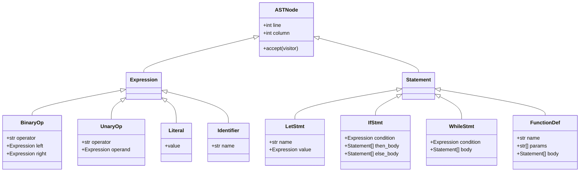
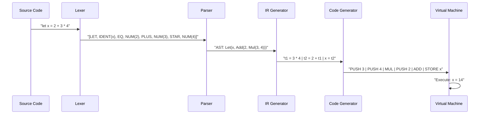

# Mini Compiler DSL

A complete compiler pipeline for a small domain-specific language: lexer (tokenization via finite automata), recursive-descent parser, abstract syntax tree construction, intermediate representation (three-address code), and code generation targeting a stack-based virtual machine. Built in Python to make every compilation phase inspectable — you can see the token stream, parse tree, AST, IR, and generated bytecode for any input program. Demonstrates how high-level source code becomes executable instructions, one transformation at a time.

## Theory & Background

### Why Build a Compiler?

Compilers are among the most elegant pieces of software ever designed. They solve a deceptively hard problem: translating a human-readable language into machine-executable instructions while preserving meaning, catching errors, and optimizing performance. Every time you write a SQL query, a configuration file, a template, or a formula in a spreadsheet, a compiler or interpreter is turning your text into actions.

Understanding compiler construction unlocks the ability to build domain-specific languages (DSLs) — small, focused languages tailored to a specific problem domain. Instead of forcing users to express their intent in a general-purpose language, a DSL lets them write in the language of their domain: queries for data, rules for business logic, patterns for text matching, or formulas for computation.

### The Compilation Pipeline

A compiler transforms source code through a series of well-defined phases. Each phase takes one representation and produces a cleaner, lower-level one. The key insight is **separation of concerns** — each phase handles one aspect of the translation, making the whole system modular and testable.

```mermaid
flowchart LR
    Source["Source Code"] --> Lexer["Lexer"]
    Lexer -->|"Token Stream"| Parser["Parser"]
    Parser -->|"Parse Tree"| AST["AST Builder"]
    AST -->|"Abstract Syntax Tree"| Semantic["Semantic Analysis"]
    Semantic -->|"Annotated AST"| IRGen["IR Generator"]
    IRGen -->|"Three-Address Code"| Optimizer["Optimizer"]
    Optimizer -->|"Optimized IR"| CodeGen["Code Generator"]
    CodeGen -->|"Bytecode"| VM["Virtual Machine"]

    style Lexer fill:#3498db,color:#fff
    style Parser fill:#2ecc71,color:#fff
    style IRGen fill:#e74c3c,color:#fff
    style CodeGen fill:#9b59b6,color:#fff
```



### Lexical Analysis (Lexer)

The lexer (also called a scanner or tokenizer) reads raw source text and produces a stream of **tokens** — the smallest meaningful units of the language. It strips whitespace and comments, identifies keywords, operators, literals, and identifiers, and reports errors for invalid characters.

Lexing is implemented as a **finite automaton**. Each state represents a position within a potential token, and transitions are driven by the next input character. For example, seeing a digit transitions to the "reading a number" state, and seeing a letter transitions to the "reading an identifier" state.

The lexer processes input in $O(n)$ time where $n$ is the source length. Each character is examined exactly once. The token stream is typically 3-5x smaller than the raw source (by character count), since whitespace and comments are discarded.

Formally, a lexer is a function that partitions the input string $s$ into a sequence of tokens:

```math
\text{lex}(s) = [t_1, t_2, \ldots, t_k] \quad \text{where } s = \text{lexeme}(t_1) \| \text{ws}_1 \| \text{lexeme}(t_2) \| \cdots
```

Each token $t_i$ has a **type** (keyword, identifier, number, operator) and a **lexeme** (the actual text). The lexer uses **maximal munch** — it always matches the longest possible token at each position.

### Parsing (Recursive Descent)

The parser takes the token stream and builds a **parse tree** that reflects the grammatical structure of the program. Our parser uses **recursive descent** — each grammar rule becomes a function that consumes tokens and returns a tree node. This is the most intuitive parsing technique: the code mirrors the grammar directly.

The grammar for our DSL is defined as a **context-free grammar (CFG)**:

```math
\begin{aligned}
\text{program} &\to \text{statement}^* \\
\text{statement} &\to \text{let\_stmt} \mid \text{if\_stmt} \mid \text{while\_stmt} \mid \text{expr\_stmt} \\
\text{let\_stmt} &\to \texttt{let} \; \text{IDENT} \; \texttt{=} \; \text{expr} \\
\text{expr} &\to \text{term} \; ((\texttt{+} \mid \texttt{-}) \; \text{term})^* \\
\text{term} &\to \text{factor} \; ((\texttt{*} \mid \texttt{/}) \; \text{factor})^* \\
\text{factor} &\to \text{NUMBER} \mid \text{IDENT} \mid \texttt{(} \; \text{expr} \; \texttt{)} \mid \texttt{-} \; \text{factor}
\end{aligned}
```

Recursive descent works for **LL(1) grammars** — grammars where the parser can decide which rule to apply by looking at just one token ahead. The parser's time complexity is $O(n)$ for LL(1) grammars, where $n$ is the number of tokens.

**Operator precedence** is encoded in the grammar structure: multiplication and division bind tighter than addition and subtraction because `term` (which handles `*` and `/`) is nested inside `expr` (which handles `+` and `-`). This eliminates ambiguity without explicit precedence tables.

### Abstract Syntax Tree (AST)

The parse tree contains syntactic noise (parentheses, semicolons, keyword tokens) that is irrelevant for later phases. The **AST** is a cleaned-up version that retains only the semantic structure. For example, the expression `(2 + 3) * 4` produces a parse tree with parenthesis nodes, but the AST is simply:

```
Multiply
├── Add
│   ├── Literal(2)
│   └── Literal(3)
└── Literal(4)
```

Each AST node type corresponds to a language construct: `BinaryOp`, `UnaryOp`, `Literal`, `Identifier`, `LetStatement`, `IfStatement`, `WhileStatement`, `FunctionDef`, `FunctionCall`. The AST is the central data structure — all subsequent phases (type checking, optimization, code generation) operate on it.



### Intermediate Representation (Three-Address Code)

Before generating final code, the compiler lowers the AST into **three-address code (TAC)** — a flat sequence of instructions where each instruction has at most one operator and three operands (two sources and one destination). TAC makes optimization straightforward because every operation is explicit and there are no nested expressions.

The expression `(a + b) * (c - d)` becomes:

```
t1 = a + b
t2 = c - d
t3 = t1 * t2
```

Each TAC instruction has the form:

```math
x = y \; \text{op} \; z \quad \text{or} \quad x = \text{op} \; y \quad \text{or} \quad x = y
```

where $x$, $y$, $z$ are variables or temporaries and $\text{op}$ is an arithmetic, logical, or comparison operator. Control flow is represented with labels and jumps:

```math
\texttt{if } x \; \text{relop} \; y \; \texttt{goto } L \quad | \quad \texttt{goto } L \quad | \quad L:
```

The number of temporaries generated is bounded by the depth of the AST:

```math
|\text{temps}| \leq \text{depth}(\text{AST})
```

### Code Generation

The final phase translates TAC into executable bytecode for our stack-based virtual machine. A stack machine is simpler to target than a register machine — every operation pops its operands from the stack and pushes the result. The TAC instruction `t3 = t1 * t2` becomes:

```
LOAD t1    ; push t1 onto stack
LOAD t2    ; push t2 onto stack
MUL        ; pop two, push product
STORE t3   ; pop result into t3
```

The VM instruction set includes: `PUSH`, `LOAD`, `STORE`, `ADD`, `SUB`, `MUL`, `DIV`, `CMP`, `JMP`, `JZ` (jump if zero), `JNZ` (jump if not zero), `CALL`, `RET`, and `HALT`.



### Tradeoffs and Alternatives

| Aspect | This Implementation | Alternative | Tradeoff |
|--------|-------------------|-------------|----------|
| **Lexer** | Hand-written finite automaton | Generated lexer (flex, re2c) | Hand-written is more educational and debuggable; generated lexers handle complex token rules (Unicode, nested comments) more robustly |
| **Parser** | Recursive descent (LL(1)) | Parser generator (ANTLR, yacc) or Pratt parser | Recursive descent is intuitive and maps directly to the grammar; Pratt parsing handles operator precedence more elegantly; parser generators handle larger grammars |
| **IR** | Three-address code | SSA (Static Single Assignment) | TAC is simpler to generate and understand; SSA enables more powerful optimizations (constant propagation, dead code elimination) but requires phi-node insertion |
| **Code target** | Stack-based VM | Register-based VM (Lua) or native code (LLVM) | Stack VM is trivial to target; register VM is 20-30% faster due to fewer memory operations; native code via LLVM gives real performance but adds massive complexity |
| **Type system** | Dynamic typing | Static typing with inference | Dynamic typing simplifies the compiler; static typing catches errors at compile time and enables type-directed optimizations |

### Key References

- Aho, Lam, Sethi & Ullman, "Compilers: Principles, Techniques, and Tools" (2nd ed., 2006) — the Dragon Book
- Nystrom, "Crafting Interpreters" (2021) — [Free online](https://craftinginterpreters.com/)
- Appel, "Modern Compiler Implementation in ML" (1998) — functional approach to compiler construction
- Cooper & Torczon, "Engineering a Compiler" (3rd ed., 2022) — practical compiler engineering
- Grune et al., "Modern Compiler Design" (2nd ed., 2012) — comprehensive reference

## Real-World Applications

Compilers and language processing are everywhere in modern software, far beyond traditional programming languages. Any system that accepts structured input and transforms it into actions is using compiler techniques. Understanding the compilation pipeline enables engineers to build better tools, faster query engines, and more expressive configuration systems.

| Industry | Use Case | Impact |
|----------|----------|--------|
| **Domain-specific languages** | Custom languages for financial modeling (quantitative trading rules), infrastructure (Terraform HCL), and data pipelines (dbt SQL templating) | Enables domain experts to express complex logic without learning a general-purpose language, reducing errors and development time by 50-80% |
| **Query engines** | SQL parsers and optimizers in databases (PostgreSQL, Spark SQL) that parse queries, build logical plans, optimize, and generate physical execution plans | Transforms declarative queries into efficient execution strategies, making the difference between a query taking seconds vs. hours |
| **Configuration languages** | Typed configuration languages (CUE, Dhall, Jsonnet) that catch errors at "compile time" before deployment | Prevents misconfiguration-caused outages by validating infrastructure definitions before they reach production |
| **Game scripting** | Embedded scripting languages (Lua, GDScript) compiled to bytecode for game logic, modding, and AI behavior trees | Allows game designers to iterate on gameplay without recompiling the engine, reducing iteration cycles from minutes to seconds |
| **Data transformation** | ETL expression languages that compile transformation rules into optimized data processing pipelines (Apache Calcite, dbt) | Enables analysts to write declarative transformations that the compiler optimizes into efficient parallel execution plans |

## Project Structure

```
mini-compiler-dsl/
├── src/
│   ├── __init__.py
│   ├── lexer/
│   │   ├── __init__.py
│   │   ├── tokenizer.py           # Finite automaton tokenizer with maximal munch
│   │   ├── tokens.py              # Token types and token dataclass definitions
│   │   └── source_reader.py       # Character-by-character source reader with position tracking
│   ├── parser/
│   │   ├── __init__.py
│   │   ├── recursive_descent.py   # Recursive descent parser for the DSL grammar
│   │   ├── grammar.py             # Grammar rule definitions and first/follow sets
│   │   └── errors.py              # Parse error reporting with source location
│   ├── ast_nodes/
│   │   ├── __init__.py
│   │   ├── expressions.py         # Expression AST nodes (BinaryOp, UnaryOp, Literal, etc.)
│   │   ├── statements.py          # Statement AST nodes (Let, If, While, FunctionDef)
│   │   ├── visitor.py             # Visitor pattern base class for AST traversal
│   │   └── printer.py             # AST pretty-printer for debugging
│   ├── ir/
│   │   ├── __init__.py
│   │   ├── three_address.py       # Three-address code instruction definitions
│   │   ├── ir_generator.py        # AST-to-TAC lowering pass
│   │   └── optimizer.py           # Basic optimizations (constant folding, dead code elimination)
│   └── codegen/
│       ├── __init__.py
│       ├── stack_vm.py            # Stack-based virtual machine with instruction set
│       ├── emitter.py             # TAC-to-bytecode code emitter
│       └── vm_runner.py           # VM execution engine with trace output
├── requirements.txt
├── .gitignore
└── README.md
```

## Quick Start

```bash
pip install -r requirements.txt

# Tokenize a source file and print the token stream
python -m src.lexer.tokenizer --input "let x = 2 + 3 * 4"

# Parse and print the AST
python -m src.parser.recursive_descent --input "let x = 2 + 3 * 4" --print-ast

# Generate three-address code IR
python -m src.ir.ir_generator --input "let x = 2 + 3 * 4" --print-ir

# Compile and run on the stack VM
python -m src.codegen.vm_runner --input "let x = 2 + 3 * 4" --trace

# Full pipeline with all intermediate representations
python -m src.codegen.vm_runner --input "if x > 0 { let y = x * 2 }" --verbose --all-phases
```

## Implementation Details

### What makes this non-trivial

- **Maximal munch tokenization**: The lexer must always match the longest possible token. When it sees `<=`, it must produce a single `LESS_EQUAL` token, not `LESS` followed by `EQUAL`. The implementation uses a lookahead character to disambiguate multi-character operators, handling all cases correctly including edge cases like `--` (two unary minuses vs. a decrement operator, depending on the grammar).
- **Operator precedence via grammar structure**: Instead of using a precedence table, precedence is encoded in the grammar's nesting. The parser naturally handles `2 + 3 * 4` as `2 + (3 * 4)` because multiplication is parsed at a deeper recursion level. Adding new precedence levels requires inserting new grammar rules at the right position in the hierarchy.
- **Temporary variable generation in IR**: The IR generator must create unique temporary variables for intermediate results and manage their lifetimes. The implementation uses a simple counter (`t1`, `t2`, ...) but tracks which temporaries are still live to enable future register allocation optimizations.
- **Control flow in three-address code**: Translating `if/else` and `while` into flat TAC requires generating labels and conditional/unconditional jumps. The implementation uses a label counter and backpatching — jump targets are filled in after the target code is generated, handling nested control flow correctly.
- **Stack VM execution with call frames**: The VM maintains a call stack with frames for function calls. Each frame has its own local variable space, and `CALL`/`RET` instructions push and pop frames. The implementation correctly handles recursive functions by allocating fresh frames on each call.
